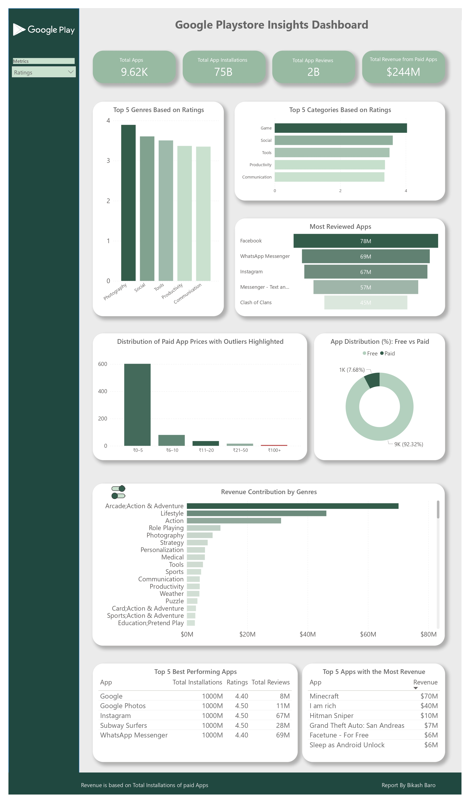

# 📱 Google Playstore Insights Dashboard
---
## 🔗 Live Dashboard & PDF Report

- 🔗 [**View Dashboard on Power BI**](https://app.powerbi.com/view?r=eyJrIjoiYTk2OWY5MjEtZjgzOC00M2UxLTgyODUtZGVlN2YwZDc4ZDZjIiwidCI6ImM2ZTU0OWIzLTVmNDUtNDAzMi1hYWU5LWQ0MjQ0ZGM1YjJjNCJ9)
- 📄 [**Download PDF Report**](google-playstore-analysis.pdf)

---

## 📊 Project Overview

This Power BI dashboard explores the **Google Playstore app ecosystem**, analyzing installs, reviews, ratings, pricing models, and monetization trends. The project focuses on both **data visualization** and **data storytelling**, offering business-ready insights backed by statistical analysis.

---

## 💡 Key Insights

- **Top Performing Apps** identified through multi-filter logic (high installs, strong ratings, high reviews)
- **Price Distribution of Paid Apps** revealed a right-skewed curve with outliers above ₹100
- **Mean: ₹5.70**, **Median: ₹3.00**, and **Standard Deviation: ₹17.60** highlight the pricing variability
- Only **~8% to 10% of all apps are paid**, showing a freemium-dominated ecosystem
- Revenue by category shows where monetization opportunities are concentrated

---

## 📌 Dashboard Features

- Dynamic tooltips with overall pricing stats
- Clear separation of free vs paid apps
- Revenue breakdown by app category
- Top 5 charts (Apps by reviews, revenue, installs)
- Price bin distribution with outlier detection
- Clean, consistent font and color formatting

---

## 🧹 Data Cleaning Summary

Performed extensive preprocessing to prepare the dataset for accurate analysis:

- Replaced special characters (e.g., `–` → `-`)
- Removed "+" symbols from install counts
- Separated size units (M, K) and standardized them as MB and KB
- Removed irrelevant rows (e.g., `#NAME?`, corrupt titles)
- Replaced NaN in ratings with 0 and converted to numeric
- Removed duplicate entries
- Normalized all-caps category names using Excel’s `PROPER()` function
- Created dimension tables for `Category` and `Genres`

---

## 🛠 Tools & Technologies

- **Power BI** – for data modeling and visualization  
- **DAX** – for calculating average, standard deviation, outliers, and dynamic tooltips  
- **Microsoft Excel** – for initial data cleaning and transformation

---

## 📂 Folder Structure
main/
├── README.md
├── dashboardimage.jpg
├── google playstore analysis.pbix
├── google playstore analysis.pdf
├── resources/
│ ├── [CITYPNG.COM]White Google Play PlayStore Logo - 1500x1500.png
│ ├── google play store data.xlsx
│ ├── icon.png
│ ├── icons8-busssssttons-60.png
│ └── icons8-buttons-60.png

---
---

===

---

## 📚 Data Source

L. Gupta, *"Google Play Store Apps,"* Feb 2019.  
Available on [Kaggle](https://www.kaggle.com/lava18/google-play-store-apps)

---

## 👤 Author

**Bikash [Data Analyst in Progress]**  
🔗 [LinkedIn Profile](#) *(Insert your LinkedIn URL here)*  
💼 Exploring real-world data problems using Power BI, Excel, and DAX.

---

## 📩 Feedback & Collaboration

Open to feedback, suggestions, and collaboration opportunities in data analytics, visualization, and dashboard design. Let’s grow together! 🤝

---
